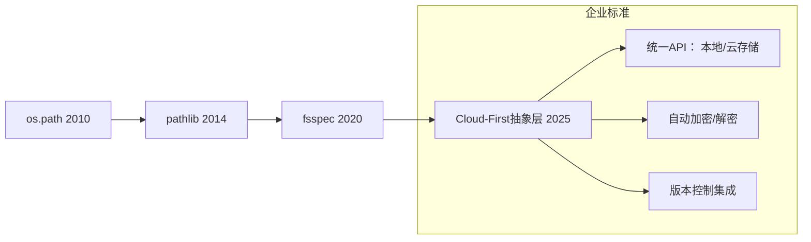

# Python 文件操作终极指南：从基础到企业级实践

> **最后更新**: 2025年12月2日  
> **适用版本**: Python 3.10+  
> **核心库**: `os`, `pathlib`, `open`, `shutil`, `tempfile`  
> **作者**: Reese

## 目录
- [核心理念](#核心理念-2025现代文件操作哲学)
- [基础操作精要](#基础操作精要)
- [os库企业级用法](#os库企业级用法)
- [文件安全与错误处理](#文件安全与错误处理)
- [企业级实战案例](#企业级实战案例)
- [性能优化技巧](#性能优化技巧)
- [云原生文件操作](#云原生文件操作-2025趋势)
- [最佳实践清单](#企业级最佳实践清单)

## 核心理念 (2025现代文件操作哲学)

### 为什么文件操作是系统可靠性的基石？
在分布式系统时代，文件操作仍是**数据持久化**、**配置管理**和**日志追踪**的核心，但现代实践已演进：
- 🔄 **从本地到云原生**：抽象文件系统层 (S3, GCS)
- 🔒 **安全优先**：最小权限原则 + 内容验证
- ⚡ **性能关键**：大文件流式处理 + 异步IO
- 🧩 **可移植性**：跨平台路径处理 (告别`os.path.join`)
- 📜 **原子性保障**：写入-重命名模式防止数据损坏

### 2025年工具链演进


## 基础操作精要

### 1. `open()` 函数现代用法
```python
# ✅ 最佳实践：永远使用上下文管理器
with open("data.txt", mode="r", encoding="utf-8") as f:
    content = f.read()  # 小文件直接读取

# 大文件逐行处理 (内存安全)
with open("large.log", "r") as f:
    for line in f:  # 惰性迭代，内存恒定
        process_line(line)

# 二进制模式 (处理非文本文件)
with open("image.png", "rb") as f:
    image_data = f.read()
    
# 写入文件 (自动创建目录)
from pathlib import Path
Path("reports/2025").mkdir(parents=True, exist_ok=True)

with open("reports/2025/data.csv", "w", newline="") as f:
    writer = csv.writer(f)
    writer.writerow(["date", "value"])
```

### 2. 模式参数深度解析
| 模式 | 说明                  | 企业场景                  | 安全风险               |
|------|-----------------------|--------------------------|-----------------------|
| `r`  | 读 (默认)             | 配置加载                 | 文件不存在异常        |
| `w`  | 写 (覆盖)             | 生成报告                 | **意外覆盖关键数据**  |
| `a`  | 追加                  | 日志记录                 | 无                   |
| `x`  | 独占创建 (防覆盖)     | 事务性写入               | 文件已存在异常        |
| `+`  | 读写                  | 数据库文件               | 并发风险             |
| `b`  | 二进制模式            | 媒体/加密文件            | 编码错误             |
| `t`  | 文本模式 (默认)       | 日志/配置                | 编码问题             |

**关键实践**：
```python
# 防覆盖的写入 (2025企业标准)
try:
    with open("critical.conf", "x") as f:  # 仅当文件不存在时创建
        f.write(new_config)
except FileExistsError:
    logger.error("拒绝覆盖关键配置文件！")
    raise SystemExit(1)

# 安全追加 (带fsync)
with open("audit.log", "a") as f:
    f.write(f"[{datetime.utcnow().isoformat()}] User login\n")
    f.flush()  # 确保写入内核缓冲区
    os.fsync(f.fileno())  # 确保写入物理磁盘
```

## os库企业级用法

### 1. 路径操作 (pathlib 优先)
```python
from pathlib import Path

# 创建跨平台路径 (告别os.path.join!)
base_dir = Path("/data") / "projects" / "finance"
log_path = base_dir / "logs" / f"app-{datetime.now():%Y%m}.log"

# 检查存在性 (安全模式)
if not log_path.exists():
    log_path.parent.mkdir(parents=True, exist_ok=True)

# 获取元数据
if log_path.is_file():
    print(f"Size: {log_path.stat().st_size} bytes")
    print(f"Modified: {datetime.fromtimestamp(log_path.stat().st_mtime)}")

# 递归查找 (安全排除敏感目录)
for config_file in Path("/etc/app").rglob("*.yaml"):
    if "secrets" not in str(config_file.parent):
        process_config(config_file)
```

### 2. 目录管理 (原子操作)
```python
import shutil
from tempfile import TemporaryDirectory

def safe_update_app():
    """原子更新应用目录 (零停机)"""
    with TemporaryDirectory() as temp_dir:
        temp_path = Path(temp_dir)
        
        # 1. 在临时目录准备新版本
        extract_tarball("app-v2.tgz", temp_path)
        
        # 2. 验证完整性
        if not validate_app(temp_path):
            raise RuntimeError("验证失败，中止更新")
        
        # 3. 原子切换 (重命名是原子操作)
        live_dir = Path("/opt/app")
        backup_dir = Path(f"/opt/app-backup-{int(time.time())}")
        
        if live_dir.exists():
            live_dir.rename(backup_dir)
        temp_path.rename(live_dir)
        
        # 4. 异步清理备份
        threading.Thread(target=lambda: shutil.rmtree(backup_dir, ignore_errors=True)).start()
```

### 3. 环境与权限 (安全关键)
```python
import os
import stat

def secure_file_creation(filepath: str, content: str):
    """创建权限受限的文件 (0600)"""
    # 1. 创建临时文件 (同一文件系统)
    dir_path = Path(filepath).parent
    with tempfile.NamedTemporaryFile(
        dir=dir_path, 
        delete=False,
        mode="w",
        encoding="utf-8"
    ) as tmp:
        tmp.write(content)
        tmp_path = Path(tmp.name)
    
    # 2. 设置严格权限
    os.chmod(tmp_path, stat.S_IRUSR | stat.S_IWUSR)  # 0600
    
    # 3. 原子重命名 (保证完整性)
    tmp_path.rename(filepath)
    
    # 4. 验证权限
    actual_mode = stat.S_IMODE(os.lstat(filepath).st_mode)
    if actual_mode != 0o600:
        os.chmod(filepath, 0o600)
        logger.warning(f"修正文件权限: {filepath}")
```

## 文件安全与错误处理

### 企业级错误分类
```python
class FileOperationError(Exception):
    """基类异常，包含上下文信息"""
    def __init__(self, message, filepath=None, operation=None):
        self.filepath = Path(filepath).resolve() if filepath else None
        self.operation = operation
        super().__init__(f"{message} [file={self.filepath}, op={self.operation}]")

class PermissionError(FileOperationError): pass
class FileNotFoundError(FileOperationError): pass
class DataCorruptionError(FileOperationError): pass

def safe_read_config(config_path: str) -> dict:
    """安全读取配置，带验证和错误分类"""
    try:
        with open(config_path, "r") as f:
            config = json.load(f)
        
        # 验证关键字段
        if "api_key" not in config:
            raise DataCorruptionError("缺少必需字段: api_key", config_path, "validate")
        
        # 检查敏感数据是否加密
        if "api_key" in config and not config["api_key"].startswith("enc:"):
            logger.warning("检测到未加密的API密钥！")
        
        return config
    
    except json.JSONDecodeError as e:
        raise DataCorruptionError(f"JSON解析失败: {str(e)}", config_path, "read") from e
    except OSError as e:
        if e.errno == errno.EACCES:
            raise PermissionError(f"权限不足: {e.strerror}", config_path, "open") from e
        elif e.errno == errno.ENOENT:
            raise FileNotFoundError(f"文件不存在: {e.strerror}", config_path, "open") from e
        raise FileOperationError(f"OS错误: {e.strerror}", config_path, "open") from e
```

### 安全文件删除 (防恢复)
```python
def secure_delete(filepath: str, passes: int = 3):
    """安全擦除文件 (符合NIST 800-88标准)"""
    if not Path(filepath).exists():
        return
    
    # 1. 覆盖内容
    file_size = Path(filepath).stat().st_size
    with open(filepath, "r+b") as f:
        for i in range(passes):
            # 不同覆盖模式
            patterns = [
                b"\x00" * file_size,  # 全零
                b"\xFF" * file_size,  # 全一
                os.urandom(file_size) # 随机
            ]
            f.seek(0)
            f.write(patterns[i % len(patterns)])
            f.flush()
            os.fsync(f.fileno())
    
    # 2. 重命名防止恢复
    secure_name = f".del_{uuid.uuid4().hex}"
    Path(filepath).rename(Path(filepath).parent / secure_name)
    
    # 3. 删除
    os.remove(secure_name)
```

## 企业级实战案例

### 案例1: 零丢失日志轮转 (Log Rotation)
```python
import logging
from logging.handlers import TimedRotatingFileHandler
import signal
import threading

class SafeTimedRotatingFileHandler(TimedRotatingFileHandler):
    """企业级日志轮转，支持信号安全重载"""
    
    def __init__(self, filename, when='midnight', backupCount=30, **kwargs):
        super().__init__(filename, when=when, backupCount=backupCount, **kwargs)
        self._lock = threading.RLock()
        self._register_signal_handler()
    
    def _register_signal_handler(self):
        """注册SIGHUP处理程序 (平滑重载)"""
        def handle_sighup(signum, frame):
            with self._lock:
                self.doRollover()  # 安全轮转
        signal.signal(signal.SIGHUP, handle_sighup)
    
    def emit(self, record):
        """线程安全的emit实现"""
        try:
            with self._lock:
                super().emit(record)
        except Exception:
            self.handleError(record)
    
    def close(self):
        """安全关闭"""
        with self._lock:
            super().close()

# 配置企业级日志
def setup_enterprise_logging(log_path: str):
    logger = logging.getLogger()
    logger.setLevel(logging.INFO)
    
    # 创建安全handler
    handler = SafeTimedRotatingFileHandler(
        log_path,
        when="midnight",
        backupCount=90,  # 90天保留
        encoding="utf-8",
        utc=True
    )
    
    # 格式化 (ISO8601时间戳)
    formatter = logging.Formatter(
        '%(asctime)s.%(msecs)03dZ %(levelname)-8s %(name)s:%(lineno)d - %(message)s',
        datefmt='%Y-%m-%dT%H:%M:%S'
    )
    handler.setFormatter(formatter)
    
    logger.addHandler(handler)
    return logger

# 在应用中
logger = setup_enterprise_logging("/var/log/app/audit.log")
logger.info("系统启动完成")
```

### 案例2: 云存储抽象层 (2025多云架构)
```python
from abc import ABC, abstractmethod
from typing import BinaryIO, Optional
import boto3
from google.cloud import storage

class StorageBackend(ABC):
    """统一存储抽象接口"""
    
    @abstractmethod
    def upload_file(self, file_path: str, key: str, metadata: Optional[dict] = None):
        pass
    
    @abstractmethod
    def download_file(self, key: str, file_path: str):
        pass
    
    @abstractmethod
    def get_file_stream(self, key: str) -> BinaryIO:
        pass
    
    @abstractmethod
    def delete_file(self, key: str):
        pass

class S3Backend(StorageBackend):
    """AWS S3实现"""
    
    def __init__(self, bucket_name: str, region: str = "us-east-1"):
        self.s3 = boto3.client("s3", region_name=region)
        self.bucket = bucket_name
    
    def upload_file(self, file_path: str, key: str, metadata: Optional[dict] = None):
        extra_args = {"Metadata": metadata} if metadata else {}
        self.s3.upload_file(file_path, self.bucket, key, ExtraArgs=extra_args)
    
    def get_file_stream(self, key: str) -> BinaryIO:
        from io import BytesIO
        obj = self.s3.get_object(Bucket=self.bucket, Key=key)
        return BytesIO(obj["Body"].read())

class GCSBackend(StorageBackend):
    """Google Cloud Storage实现"""
    
    def __init__(self, bucket_name: str):
        self.client = storage.Client()
        self.bucket = self.client.bucket(bucket_name)
    
    def upload_file(self, file_path: str, key: str, metadata: Optional[dict] = None):
        blob = self.bucket.blob(key)
        if metadata:
            blob.metadata = metadata
        blob.upload_from_filename(file_path)
    
    def get_file_stream(self, key: str) -> BinaryIO:
        from io import BytesIO
        blob = self.bucket.blob(key)
        return BytesIO(blob.download_as_bytes())

# 企业级配置 (运行时切换)
def get_storage_backend(env: str = "production") -> StorageBackend:
    """根据环境返回存储后端"""
    if env == "aws":
        return S3Backend(
            bucket_name=os.getenv("S3_BUCKET"),
            region=os.getenv("AWS_REGION", "us-east-1")
        )
    elif env == "gcp":
        return GCSBackend(
            bucket_name=os.getenv("GCS_BUCKET")
        )
    else:  # 本地开发
        from .local_backend import LocalStorageBackend
        return LocalStorageBackend(base_path="/tmp/storage")

# 业务代码 (与存储解耦)
def process_document(doc_id: str):
    backend = get_storage_backend()
    try:
        stream = backend.get_file_stream(f"documents/{doc_id}.pdf")
        result = advanced_pdf_processor(stream)
        backend.upload_file(
            result, 
            f"processed/{doc_id}.json",
            metadata={"processed_by": "v1.2"}
        )
    finally:
        stream.close()
```

## 性能优化技巧

### 大文件处理 (10GB+)
```python
import mmap
import csv
from concurrent.futures import ThreadPoolExecutor

def process_large_csv(file_path: str):
    """高效处理10GB+ CSV文件 (零内存复制)"""
    
    # 1. 内存映射 (避免多次读取)
    with open(file_path, "r+b") as f:
        mmapped_file = mmap.mmap(f.fileno(), 0, access=mmap.ACCESS_READ)
        
        # 2. 创建文件对象视图
        mmapped_io = io.TextIOWrapper(
            io.BufferedReader(mmapped_file),
            encoding="utf-8",
            newline=""
        )
        
        # 3. 流式解析
        reader = csv.DictReader(mmapped_io)
        
        # 4. 并行处理 (注意：CPU密集型用ProcessPool)
        with ThreadPoolExecutor(max_workers=os.cpu_count()) as executor:
            for batch in batched(reader, 1000):  # 每批1000行
                executor.submit(process_batch, batch)
        
        # 5. 确保资源释放
        mmapped_io.detach()
        mmapped_file.close()

def batched(iterable, n):
    """分批迭代器 (Python 3.12+ 标准库)"""
    it = iter(iterable)
    while batch := list(itertools.islice(it, n)):
        yield batch
```

### 异步文件IO (ASGI应用)
```python
import aiofiles
import aiohttp
from fastapi import FastAPI, UploadFile

app = FastAPI()

@app.post("/upload/")
async def upload_large_file(file: UploadFile):
    """处理大文件上传 (非阻塞)"""
    temp_path = f"/tmp/upload_{uuid.uuid4().hex}"
    
    try:
        # 1. 异步写入临时文件
        async with aiofiles.open(temp_path, "wb") as out_file:
            while content := await file.read(1024 * 1024):  # 1MB chunks
                await out_file.write(content)
        
        # 2. 验证文件类型 (防恶意上传)
        if not is_safe_file(temp_path):
            raise HTTPException(415, "不支持的文件类型")
        
        # 3. 异步上传到云存储
        async with aiohttp.ClientSession() as session:
            with open(temp_path, "rb") as f:
                form = aiohttp.FormData()
                form.add_field("file", f, filename=file.filename)
                async with session.post(
                    os.getenv("CLOUD_UPLOAD_URL"),
                    data=form,
                    headers={"Authorization": f"Bearer {get_jwt_token()}"}
                ) as resp:
                    if resp.status != 200:
                        raise HTTPException(500, "存储服务错误")
        
        return {"status": "success", "filename": file.filename}
    
    finally:
        # 4. 清理临时文件
        if os.path.exists(temp_path):
            os.remove(temp_path)
```

## 云原生文件操作 (2025趋势)

### 统一文件API (fsspec生态)
```python
import fsspec

def enterprise_file_copy(source: str, destination: str):
    """
    统一复制文件 (支持本地/S3/GCS/Azure)
    示例:
      source="s3://bucket/data.csv"
      destination="gcs://archive/2025/data.csv"
    """
    # 1. 自动选择后端
    with fsspec.open(source, "rb") as src, fsspec.open(destination, "wb") as dst:
        # 2. 流式复制 (内存恒定)
        while chunk := src.read(8192):  # 8KB chunks
            dst.write(chunk)
    
    # 3. 验证完整性
    src_size = fsspec.get_fs_token_paths(source)[0].size(source)
    dst_size = fsspec.get_fs_token_paths(destination)[0].size(destination)
    
    if src_size != dst_size:
        fsspec.rm(destination)  # 删除损坏文件
        raise DataCorruptionError(f"复制失败: {src_size} != {dst_size}", destination, "copy")

# 配置认证 (集中管理)
fsspec.config.set(
    s3={"key": os.getenv("AWS_ACCESS_KEY"), "secret": os.getenv("AWS_SECRET_KEY")},
    gcs={"token": "/path/to/service-account.json"}
)
```

### 事件驱动文件处理 (Kubernetes生态)
```yaml
# file-processor.yaml (K8s自定义资源)
apiVersion: enterprise.storage/v1
kind: FileProcessor
metadata:
  name: invoice-processor
spec:
  watchPaths:
    - s3://invoices/raw/
    - gs://invoices/staging/
  triggers:
    - event: CREATE
      pattern: "*.pdf"
      action: 
        image: company/invoice-processor:v1.3
        env:
          - name: OUTPUT_BUCKET
            value: s3://invoices/processed/
        resources:
          limits:
            memory: "512Mi"
            cpu: "500m"
  retention:
    successful: 7d    # 成功后7天删除
    failed: 30d       # 失败后保留30天
```

## 企业级最佳实践清单

### ✅ 必做事项
1. **路径处理**：永远使用 `pathlib.Path` 替代字符串拼接
2. **上下文管理**：100% 使用 `with open(...)` 保证资源释放
3. **编码显式**：始终指定 `encoding="utf-8"` (避免平台差异)
4. **权限最小化**：
   ```python
   os.chmod(file_path, 0o600)  # 仅所有者可读写
   ```
5. **原子写入**：
   ```python
   tmp_path = Path(file_path).with_suffix(".tmp")
   with open(tmp_path, "w") as f:
       f.write(content)
   tmp_path.replace(file_path)  # 原子重命名
   ```
6. **大文件流式处理**：永远不使用 `read()` 读取未知大小文件
7. **错误分类**：自定义异常继承 `OSError` 保留上下文

### ❌ 严禁事项
1. **硬编码路径**：
   ❌ `"/home/user/data.csv"`  
   ✅ `Path.home() / "data.csv"`
   
2. **忽略权限**：
   ❌ `open("secret.key", "w")`  
   ✅ `secure_file_creation("secret.key", content)`
   
3. **不验证输入**：
   ❌ `open(user_provided_path)`  
   ✅ `validate_path(user_provided_path, base_dir=Path("/safe/base"))`
   
4. **同步IO阻塞**：
   ❌ 在ASGI/Flask请求中直接 `open(large_file)`  
   ✅ 使用 `aiofiles` 或后台任务

### 🔐 安全加固
```python
def validate_path(user_path: str, base_dir: Path) -> Path:
    """防止路径遍历攻击"""
    resolved = (base_dir / user_path).resolve()
    if not resolved.is_relative_to(base_dir.resolve()):
        raise SecurityError(f"非法路径访问: {user_path}")
    return resolved

# 使用示例
try:
    safe_path = validate_path("../../etc/passwd", base_dir=Path("/app/uploads"))
except SecurityError:
    logger.security_alert("路径遍历攻击尝试")
```

## 未来演进方向

### 1. 不可变文件系统 (2026前瞻)
```python
# 实验性：内容寻址存储
from casfs import ContentAddressableFS

fs = ContentAddressableFS("/data/cas")
with fs.open_write() as f:
    f.write(b"重要数据")
    cid = f.finalize()  # 返回内容ID: "bafybeigdyrzt5sfp7udm7hu76uh7y26nf3efuylqabf3oclgtqy55fbzdi"

# 通过内容ID读取 (自动去重)
with fs.open_read(cid) as f:
    assert f.read() == b"重要数据"
```

### 2. 量子安全文件加密
```python
from qrypto.files import QuantumResistantFile

# 符合NIST PQC标准
with QuantumResistantFile(
    "secrets.conf", 
    mode="w",
    key=load_quantum_key("master-key.pqk")
) as f:
    f.write(json.dumps({"api_key": "SENSITIVE"}))
```

> **核心原则**：  
> *"文件操作不是简单的IO，而是数据生命周期的起点。  
> 2025年的工程师必须同时考虑：  
> 安全性 × 性能 × 可移植性 × 审计性"*  
> — Reese, 2025年12月2日

```python
# 每日检查清单
def file_operation_health_check():
    """企业环境每日检查"""
    checks = [
        ("权限扫描", lambda: scan_permissions("/app")),
        ("大文件预警", lambda: alert_large_files("/data", threshold_gb=10)),
        ("损坏检测", lambda: verify_checksums("/archives")),
        ("云同步状态", lambda: check_cloud_sync_status()),
    ]
    
    results = {}
    for name, func in checks:
        try:
            results[name] = func()
        except Exception as e:
            results[name] = f"失败: {str(e)}"
    return results
```