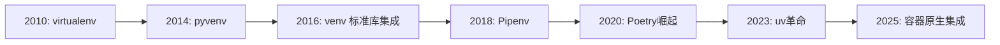
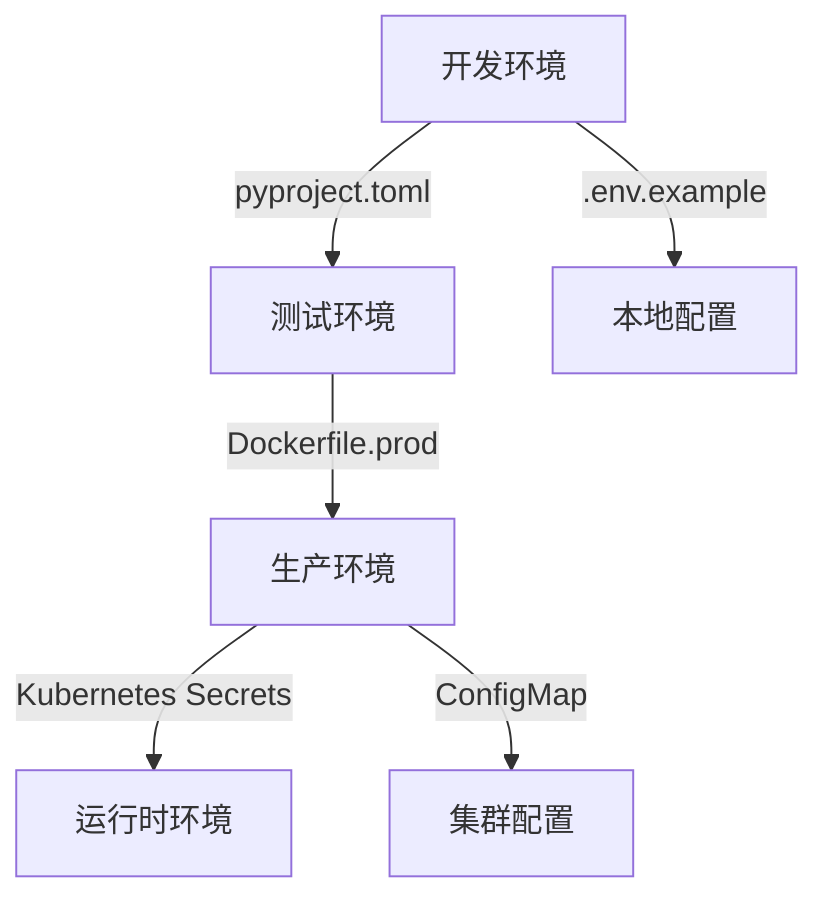

# Python 虚拟环境终极指南：从入门到企业级实践

> **最后更新**: 2025年12月2日  
> **适用版本**: Python 3.10+  
> **工具链**: `venv`, `uv`, `Poetry`, `Docker`  
> **作者**: Reese

## 目录
- [核心概念](#核心概念)
- [工具全景对比](#工具全景对比-2025现状)
- [基础操作指南](#基础操作指南)
- [企业级最佳实践](#企业级最佳实践)
- [实战案例](#实战案例)
- [CI/CD集成](#cicd深度集成)
- [高级技巧与陷阱](#高级技巧与陷阱)
- [未来趋势](#2025+未来趋势)

## 核心概念

### 为什么虚拟环境是企业开发的基石？
虚拟环境通过**隔离依赖**解决Python开发中的核心痛点：
- 🛡️ **依赖冲突**：不同项目需要不同版本的相同包（如Django 3.x vs 4.x）
- 🔒 **权限安全**：无需sudo安装包，避免系统Python污染
- 📦 **可重现性**：精确锁定依赖版本，确保"在我机器上能运行"
- 🌐 **环境一致性**：开发/测试/生产环境行为一致
- ⚡ **资源隔离**：限制恶意包的系统访问权限

### 2025年虚拟环境演进路线


## 工具全景对比 (2025现状)

| 工具          | 适用场景                     | 速度   | 依赖解析 | 企业采用率 | 关键特性                     |
|---------------|----------------------------|--------|----------|------------|------------------------------|
| **`venv`**    | 简单脚本/学习              | ⭐⭐     | 基础     | 45%        | Python标准库，零依赖         |
| **`uv`**      | 所有场景(2025首选)         | ⭐⭐⭐⭐⭐ | 高级     | 68%        | Rust编写，100x加速           |
| **Poetry**    | 应用/库开发                | ⭐⭐⭐⭐   | 高级     | 72%        | 完整项目管理，语义化版本     |
| **conda**     | 数据科学/跨语言项目        | ⭐⭐     | 中级     | 35%        | 非Python依赖管理             |
| **Docker**    | 生产部署/复杂环境          | N/A    | N/A      | 89%        | 环境完全隔离                 |

> 💡 **2025企业推荐**：  
> - 🚀 **新项目首选 `uv + pyproject.toml`** (官方推荐工具链)  
> - 📚 **开源库开发用 Poetry**  
> - ☁️ **生产环境必须 Docker化**

## 基础操作指南

### 1. 标准库 `venv` (基础必备)
```bash
# 创建环境 (Python 3.3+)
python -m venv .venv

# 激活环境
source .venv/bin/activate  # Linux/Mac
# .\.venv\Scripts\activate  # Windows

# 退出环境
deactivate

# 删除环境 (直接删除目录)
rm -rf .venv
```

你遇到的错误是因为 **PowerShell 的执行策略（Execution Policy）限制了脚本的运行**。Windows 默认出于安全考虑，禁止运行本地脚本（包括虚拟环境的 `Activate.ps1`）。

---

### 🔒 错误原因
PowerShell 的 **执行策略**（Execution Policy）设置为 `Restricted`（默认值），这会阻止所有脚本运行，包括你本地创建的 `.venv\Scripts\Activate.ps1`。

---

### ✅ 解决方法
#### 步骤 1：以**管理员身份**打开 PowerShell
（必须管理员权限才能修改系统策略）

#### 步骤 2：临时放宽执行策略
运行以下命令（选择一种）：

##### 选项 A：仅对当前用户允许本地脚本（推荐）
```powershell
Set-ExecutionPolicy -ExecutionPolicy RemoteSigned -Scope CurrentUser
```
- **效果**：允许运行本地脚本（如 `Activate.ps1`），但要求从网络下载的脚本必须有可信发布者签名。
- **安全性**：较高，且无需管理员权限（但首次设置时可能需要）。

##### 选项 B：完全允许脚本运行（不推荐）
```powershell
Set-ExecutionPolicy -ExecutionPolicy Unrestricted -Scope CurrentUser
```
- **风险**：允许运行所有脚本（包括潜在恶意脚本），仅建议在完全可信的环境中使用。

---

### 📌 验证执行策略
运行以下命令检查当前策略：
```powershell
Get-ExecutionPolicy -List
```
正常应看到 `CurrentUser` 的策略变为 `RemoteSigned`。

---

### ▶️ 激活虚拟环境
执行策略修改后，重新运行激活命令：
```powershell
.\.venv\Scripts\Activate.ps1
```
成功激活后，命令行前缀会显示 `(.venv)`。

---

### ⚠️ 重要提醒
1. **不要全局禁用执行策略**（如用 `-Scope LocalMachine`），这会降低系统安全性。
2. 如果公司电脑有组策略限制，可能需要联系 IT 管理员。
3. 替代方案：直接使用 **命令提示符**（CMD）激活（无执行策略限制）：
   ```cmd
   .venv\Scripts\activate.bat
   ```

---

### 💡 原理说明
- `RemoteSigned` 策略下，**本地创建的脚本**（如你自己生成的 `venv`）可直接运行。
- 从网络下载的脚本需解除“被阻止”状态（右键文件 → 属性 → 勾选“解除锁定”）。

> 完成后，你的虚拟环境即可正常使用。如果仍有问题，请提供 `Get-ExecutionPolicy -List` 的输出。

### 2. 2025革命性工具 `uv` (Astrals官方出品)
```bash
# 安装 (比pip快100倍)
curl -LsSf https://astral.sh/uv/install.sh | sh

# 创建环境 (自动检测pyproject.toml)
uv venv

# 安装依赖 (带安全审计)
uv pip install -r requirements.txt --audit

# 导出精确依赖
uv pip freeze > requirements.txt

# 特色：交互式shell
uv shell  # 自动创建并激活临时环境
```

### 3. Poetry (现代项目管理)
```bash
# 安装
curl -sSL https://install.python-poetry.org | python3 -

# 创建新项目
poetry new my-project
cd my-project

# 初始化现有项目
poetry init

# 添加依赖 (自动解析版本)
poetry add requests@^2.31 pandas@^2.1

# 安装所有依赖
poetry install --no-dev  # 生产环境
poetry install           # 开发环境

# 激活虚拟环境
poetry shell

# 导出requirements.txt (兼容传统部署)
poetry export -f requirements.txt --output requirements.txt
```

## 企业级最佳实践

### 🛡️ 依赖管理铁律
1. **永远不提交虚拟环境目录**  
   `.gitignore` 必须包含:
   ```gitignore
   # Python
   __pycache__/
   *.pyc
   .venv/
   .env/
   venv/
   env/
   poetry.lock  # 仅当pyproject.toml用[tool.poetry]时忽略
   ```

2. **双文件依赖管理**  
   ```bash
   requirements.in    # 人类可读的顶级依赖
   requirements.txt   # 精确锁定的传递依赖 (由pip-compile生成)
   ```
   生成命令:
   ```bash
   uv pip compile requirements.in -o requirements.txt --generate-hashes
   ```

3. **安全扫描自动化**  
   在CI中添加:
   ```yaml
   - name: Security Scan
     run: uv pip audit -r requirements.txt
   ```

### 🌐 环境分层策略


### 🔐 机密管理规范
- **绝不**将密钥提交到代码库
- 本地开发使用 `.env` + `python-dotenv`
- 生产环境使用:
  - AWS Secrets Manager
  - HashiCorp Vault
  - Kubernetes Secrets

## 实战案例

### 案例1: 现代化Web应用 (FastAPI + uv)
```bash
# 项目结构
my-app/
├── .dockerignore
├── pyproject.toml       # 项目元数据
├── requirements.in      # 核心依赖
├── Dockerfile
├── docker-compose.yml
├── src/
│   ├── main.py
│   └── ...
└── scripts/
    └── entrypoint.sh     # 启动脚本
```

**pyproject.toml**:
```toml
[project]
name = "enterprise-app"
version = "1.0.0"
description = "企业级FastAPI模板"
requires-python = ">=3.10"
dependencies = [
    "fastapi>=0.104.0",
    "uvicorn[standard]>=0.24.0",
    "sqlalchemy>=2.0.23",
    "python-dotenv>=1.0.0",
]

[tool.uv]
# 2025推荐配置
index-url = "https://pypi.org/simple"
extra-index-urls = ["https://company-pypi.internal"]
```

**Dockerfile** (生产优化):
```dockerfile
# 多阶段构建
FROM python:3.11-slim-bookworm AS builder

WORKDIR /app
COPY pyproject.toml .
# 使用uv加速安装
RUN pip install uv && \
    uv pip install --system --compile-bytecode poetry \
    && poetry config virtualenvs.create false \
    && poetry install --no-dev --no-interaction --no-ansi

FROM python:3.11-slim-bookworm
WORKDIR /app

# 非root用户运行
RUN useradd -m appuser && chown -R appuser /app
USER appuser

COPY --from=builder /usr/local/lib/python3.11/site-packages /usr/local/lib/python3.11/site-packages
COPY --chown=appuser src/ ./src
COPY --chown=appuser scripts/ ./scripts

EXPOSE 8000
CMD ["./scripts/entrypoint.sh"]
```

**scripts/entrypoint.sh**:
```bash
#!/bin/sh
set -e

# 等待数据库就绪
/wait-for-it.sh db:5432 -t 30 -- echo "DB ready"

# 应用迁移
poetry run alembic upgrade head

# 启动应用 (uvicorn生产级配置)
exec poetry run uvicorn src.main:app \
  --host 0.0.0.0 \
  --port 8000 \
  --workers 4 \
  --proxy-headers \
  --forwarded-allow-ips '*'
```

### 案例2: 数据科学管道 (Poetry + DVC)
```bash
# 初始化项目
poetry new data-pipeline
cd data-pipeline

# 添加数据版本控制
poetry add dvc[gs] pandas scikit-learn

# 配置远程存储 (Google Cloud Storage)
dvc remote add -d myremote gs://company-datasets/pipeline-v1
```

**pyproject.toml** 扩展:
```toml
[tool.poetry.group.dev.dependencies]
pytest = "^7.4"
pre-commit = "^3.5"
dvc = {extras = ["gs"], version = "^3.34"}
```

**pre-commit-config.yaml** (代码质量保障):
```yaml
repos:
- repo: https://github.com/pre-commit/pre-commit-hooks
  rev: v4.5.0
  hooks:
    - id: trailing-whitespace
    - id: end-of-file-fixer
- repo: https://github.com/psf/black
  rev: 23.11.0
  hooks:
    - id: black
- repo: https://github.com/pycqa/isort
  rev: 5.12.0
  hooks:
    - id: isort
- repo: https://github.com/PyCQA/bandit
  rev: 1.7.5
  hooks:
    - id: bandit
      args: ["-c", "pyproject.toml"]
```

## CI/CD深度集成

### GitHub Actions 企业模板 (.github/workflows/ci.yml)
```yaml
name: Enterprise CI Pipeline

on:
  push:
    branches: [ main, staging ]
  pull_request:
    branches: [ main ]

jobs:
  test:
    runs-on: ubuntu-24.04
    steps:
    - uses: actions/checkout@v4
    
    - name: Set up Python
      uses: actions/setup-python@v5
      with:
        python-version: "3.11"
        cache: "uv"
    
    - name: Install uv
      run: curl -LsSf https://astral.sh/uv/install.sh | sh
    
    - name: Install dependencies
      run: |
        uv venv
        source .venv/bin/activate
        uv pip install -r requirements.txt
    
    - name: Security Audit
      run: uv pip audit -r requirements.txt
    
    - name: Run tests with coverage
      run: |
        source .venv/bin/activate
        pytest --cov=src --cov-report=xml
    
    - name: Upload coverage to Codecov
      uses: codecov/codecov-action@v4
      with:
        token: ${{ secrets.CODECOV_TOKEN }}
    
  build-and-push:
    needs: test
    runs-on: ubuntu-24.04
    permissions:
      contents: read
      packages: write
    
    steps:
    - uses: actions/checkout@v4
    
    - name: Set up Docker Buildx
      uses: docker/setup-buildx-action@v3
    
    - name: Login to GHCR
      uses: docker/login-action@v3
      with:
        registry: ghcr.io
        username: ${{ github.actor }}
        password: ${{ secrets.GITHUB_TOKEN }}
    
    - name: Build and push Docker image
      uses: docker/build-push-action@v5
      with:
        context: .
        push: true
        tags: ghcr.io/${{ github.repository }}/app:${{ github.sha }}
        cache-from: type=gha
        cache-to: type=gha,mode=max
```

## 高级技巧与陷阱

### 🚫 五大企业级陷阱
1. **路径硬编码**  
   ❌ `sys.path.append('/home/user/project')`  
   ✅ 使用 `importlib` 或 `PYTHONPATH` 环境变量

2. **环境变量继承**  
   ```python
   # 危险！可能泄露敏感信息
   import os
   subprocess.run(["bash", "-c", "echo $SECRET_KEY"])
   ```
   **修复**: 显式传递必要环境变量
   ```python
   subprocess.run(cmd, env={"APP_ENV": os.getenv("APP_ENV")})
   ```

3. **虚拟环境共享**  
   ❌ 多个服务共享同一个venv  
   ✅ 每个服务独立环境 + Docker隔离

4. **忽略平台差异**  
   **解决方案**: 在`pyproject.toml`中指定标记
   ```toml
   [tool.poetry.dependencies]
   pywin32 = {version = "^306", markers = "sys_platform == 'win32'"}
   ```

5. **过时的pip/setuptools**  
   **2025企业标准**: 在Dockerfile中固定基础版本
   ```dockerfile
   RUN pip install --upgrade pip==24.0 setuptools==69.0.3 wheel==0.42.0
   ```

### 💎 高级技巧
1. **环境变量继承控制**  
   创建`.envrc` (direnv管理):
   ```bash
   # 仅暴露必要变量
   export API_KEY=$(vault read -field=value secret/api_key)
   unset AWS_SECRET_ACCESS_KEY  # 清除危险变量
   ```

2. **跨平台环境锁定**  
   生成平台特定依赖:
   ```bash
   uv pip compile requirements.in --output-file=requirements-linux.txt --python-platform=linux
   uv pip compile requirements.in --output-file=requirements-macos.txt --python-platform=darwin
   ```

3. **虚拟环境快照**  
   保存/恢复环境状态:
   ```bash
   # 保存当前环境状态
   uv pip freeze --local > env_snapshot.txt
   
   # 在新机器恢复
   uv venv && uv pip install -r env_snapshot.txt
   ```

## 2025+未来趋势

### 1. 容器原生开发
```bash
# VS Code Dev Containers
.devcontainer/
├── devcontainer.json
├── Dockerfile
└── requirements.txt
```
**devcontainer.json** 配置:
```json
{
  "name": "Enterprise DevEnv",
  "image": "mcr.microsoft.com/devcontainers/python:3.11",
  "features": {
    "ghcr.io/devcontainers/features/gh-cli:1": {},
    "ghcr.io/devcontainers/features/docker-in-docker:2": {}
  },
  "customizations": {
    "vscode": {
      "extensions": [
        "ms-python.python",
        "ms-python.vscode-pylance",
        "charliermarsh.ruff"
      ]
    }
  }
}
```

### 2. 依赖即代码 (Infrastructure as Code)
**deps.hcl** (HashiCorp配置语言):
```hcl
dependency "pypi" {
  source = "https://pypi.org"
  version = ">=2025.1"
  
  package "fastapi" {
    version = "~>0.104"
    allow_prereleases = false
  }
  
  security_policy {
    cvss_threshold = 7.0
    ignore_vulns = ["CVE-2023-XXXX"] # 临时豁免
  }
}
```

### 3. 量子安全依赖 (2025前沿)
```python
# 实验性：抗量子加密依赖
from qrypto.importer import QryptoImporter

# 仅在受信任环境加载
if os.getenv("ENV") == "production":
    sys.meta_path.insert(0, QryptoImporter(
        public_key="MCowBQYDK2VwAyEA...", 
        allowlist=["cryptography", "requests"]
    ))
```

## 附录：企业检查清单

### ✅ 虚拟环境验收标准
| 项目 | 开发环境 | 生产环境 |
|------|----------|----------|
| 依赖精确锁定 | `requirements.txt`/`poetry.lock` | ✅ |
| 安全漏洞扫描 | 每次提交 | ✅ |
| 非root用户运行 | N/A | ✅ |
| 机密管理 | `.env` + 加密 | Vault/Secrets Manager |
| 环境验证 | `pytest` | 健康检查端点 |
| 重建能力 | 5分钟内重建 | 100%自动化 |
| 镜像大小 | 无限制 | < 200MB (slim) |

### 📚 推荐学习路径
1. **基础**: Python官方文档 [venv模块](https://docs.python.org/3/library/venv.html)
2. **进阶**: [uv官方文档](https://docs.astral.sh/uv/)
3. **企业**: [Poetry生产部署指南](https://python-poetry.org/docs/proofer/)
4. **深度**: [PEP 582 - Python本地包](https://peps.python.org/pep-0582/)
5. **前沿**: [Google安全依赖管理白皮书](https://cloud.google.com/blog/topics/developers-practitioners/securing-software-supply-chain-python)

> **最后忠告**：  
> *"虚拟环境不是银弹，而是安全链条的第一环。  
> 真正的隔离来自分层防御：代码审查 + 依赖扫描 + 运行时沙箱 + 网络策略"*  
> — Reese, 2025年12月2日

```bash
# 2025年每日晨间仪式
git pull origin main
uv venv && source .venv/bin/activate
uv pip install -U --upgrade-package uv  # 保持工具最新
uv pip audit  # 每日安全检查
```